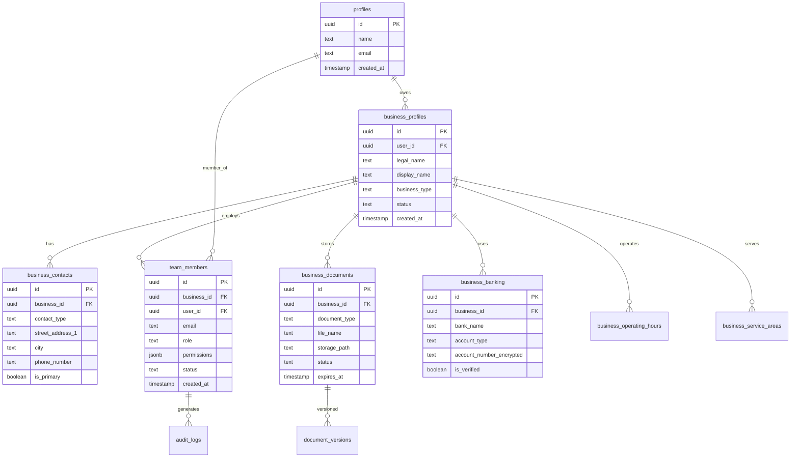

# Business Profile System - Database Architecture

## Overview

The Business Profile System uses a PostgreSQL database through Supabase, designed with scalability, security, and performance in mind. The architecture supports multi-tenant business profiles with comprehensive relationship management.

## Entity Relationship Diagram



## Table Specifications

### Core Business Tables

#### business_profiles
Primary table for business information and legal details.

```sql
CREATE TABLE business_profiles (
  id uuid PRIMARY KEY DEFAULT gen_random_uuid(),
  user_id uuid NOT NULL REFERENCES profiles(id) ON DELETE CASCADE,
  
  -- Legal Information
  legal_name text NOT NULL,
  doing_business_as text,
  business_registration_number text,
  tax_identification_number text,
  business_type text NOT NULL,
  incorporation_state text,
  incorporation_date date,
  
  -- Basic Information  
  display_name text NOT NULL,
  description text,
  industry text,
  business_category text,
  website_url text,
  
  -- Status and Verification
  status text DEFAULT 'active',
  verification_status text DEFAULT 'pending',
  profile_completion_percentage integer DEFAULT 0,
  
  -- Metadata
  created_at timestamptz DEFAULT now(),
  updated_at timestamptz DEFAULT now(),
  
  -- Constraints
  CONSTRAINT valid_business_type CHECK (
    business_type IN ('LLC', 'Corporation', 'Partnership', 'Sole Proprietorship', 'Other')
  ),
  CONSTRAINT valid_status CHECK (
    status IN ('active', 'inactive', 'suspended')
  ),
  CONSTRAINT valid_verification_status CHECK (
    verification_status IN ('pending', 'verified', 'rejected')
  ),
  CONSTRAINT completion_percentage_range CHECK (
    profile_completion_percentage >= 0 AND profile_completion_percentage <= 100
  )
);

-- Indexes
CREATE INDEX idx_business_profiles_user_id ON business_profiles(user_id);
CREATE INDEX idx_business_profiles_status ON business_profiles(status);
CREATE INDEX idx_business_profiles_verification ON business_profiles(verification_status);
CREATE INDEX idx_business_profiles_industry ON business_profiles(industry);
CREATE INDEX idx_business_profiles_completion ON business_profiles(profile_completion_percentage);

-- RLS Policy
CREATE POLICY "Users can manage business profiles if they are team members"
  ON business_profiles FOR ALL
  USING (
    id IN (
      SELECT tm.business_id FROM team_members tm
      WHERE tm.user_id = auth.uid() AND tm.status = 'active'
    )
  );
```

#### business_contacts
Manages multiple contact types and addresses for businesses.

```sql
CREATE TABLE business_contacts (
  id uuid PRIMARY KEY DEFAULT gen_random_uuid(),
  business_id uuid NOT NULL REFERENCES business_profiles(id) ON DELETE CASCADE,
  
  -- Contact Type
  contact_type text NOT NULL,
  
  -- Address Information
  street_address_1 text,
  street_address_2 text,
  city text,
  state_province text,
  postal_code text,
  country text DEFAULT 'US',
  
  -- Communication
  phone_number text,
  fax_number text,
  email_address text,
  
  -- Contact Person
  contact_person_name text,
  contact_person_title text,
  contact_person_phone text,
  contact_person_email text,
  
  -- Settings
  is_primary boolean DEFAULT false,
  is_public boolean DEFAULT false,
  
  -- Metadata
  created_at timestamptz DEFAULT now(),
  updated_at timestamptz DEFAULT now(),
  
  CONSTRAINT valid_contact_type CHECK (
    contact_type IN ('primary', 'billing', 'legal', 'technical', 'shipping')
  ),
  CONSTRAINT valid_email_format CHECK (
    email_address IS NULL OR email_address ~* '^[A-Za-z0-9._%+-]+@[A-Za-z0-9.-]+\.[A-Za-z]{2,}$'
  )
);

-- Indexes
CREATE INDEX idx_business_contacts_business_id ON business_contacts(business_id);
CREATE INDEX idx_business_contacts_type ON business_contacts(contact_type);
CREATE INDEX idx_business_contacts_primary ON business_contacts(business_id, is_primary) WHERE is_primary = true;

-- Ensure only one primary contact per business
CREATE UNIQUE INDEX idx_business_contacts_one_primary 
  ON business_contacts(business_id) WHERE is_primary = true;

-- RLS Policy
CREATE POLICY "Users can manage contacts of their businesses"
  ON business_contacts FOR ALL
  USING (
    business_id IN (
      SELECT tm.business_id FROM team_members tm
      WHERE tm.user_id = auth.uid() AND tm.status = 'active'
    )
  );
```

#### team_members
Manages business team members with role-based access control.

```sql
CREATE TABLE team_members (
  id uuid PRIMARY KEY DEFAULT gen_random_uuid(),
  business_id uuid NOT NULL REFERENCES business_profiles(id) ON DELETE CASCADE,
  user_id uuid REFERENCES profiles(id) ON DELETE SET NULL,
  
  -- Member Information
  email text NOT NULL,
  first_name text,
  last_name text,
  job_title text,
  department text,
  
  -- Access Control
  role text NOT NULL,
  permissions jsonb DEFAULT '{}',
  
  -- Status Tracking
  status text DEFAULT 'pending',
  invited_at timestamptz DEFAULT now(),
  joined_at timestamptz,
  last_active_at timestamptz,
  
  -- Invitation Management
  invitation_token text,
  invitation_expires_at timestamptz,
  
  -- Metadata
  created_at timestamptz DEFAULT now(),
  updated_at timestamptz DEFAULT now(),
  
  CONSTRAINT valid_role CHECK (
    role IN ('owner', 'admin', 'manager', 'employee', 'contractor')
  ),
  CONSTRAINT valid_status CHECK (
    status IN ('pending', 'active', 'inactive', 'suspended')
  ),
  CONSTRAINT valid_email_format CHECK (
    email ~* '^[A-Za-z0-9._%+-]+@[A-Za-z0-9.-]+\.[A-Za-z]{2,}$'
  )
);

-- Indexes
CREATE INDEX idx_team_members_business_id ON team_members(business_id);
CREATE INDEX idx_team_members_user_id ON team_members(user_id);
CREATE INDEX idx_team_members_role ON team_members(role);
CREATE INDEX idx_team_members_status ON team_members(status);
CREATE INDEX idx_team_members_email ON team_members(email);
CREATE INDEX idx_team_members_invitation_token ON team_members(invitation_token) WHERE invitation_token IS NOT NULL;

-- Ensure only one owner per business
CREATE UNIQUE INDEX idx_team_members_one_owner 
  ON team_members(business_id) WHERE role = 'owner' AND status = 'active';

-- RLS Policies
CREATE POLICY "Users can view team members of their businesses"
  ON team_members FOR SELECT
  USING (
    business_id IN (
      SELECT tm.business_id FROM team_members tm
      WHERE tm.user_id = auth.uid() AND tm.status = 'active'
    )
  );

CREATE POLICY "Owners and admins can manage team members"
  ON team_members FOR INSERT, UPDATE, DELETE
  USING (
    business_id IN (
      SELECT tm.business_id FROM team_members tm
      WHERE tm.user_id = auth.uid() 
      AND tm.status = 'active'
      AND tm.role IN ('owner', 'admin')
    )
  );
```

### Document Management Tables

#### business_documents
Central document storage with metadata and access control.

```sql
CREATE TABLE business_documents (
  id uuid PRIMARY KEY DEFAULT gen_random_uuid(),
  business_id uuid NOT NULL REFERENCES business_profiles(id) ON DELETE CASCADE,
  uploaded_by uuid REFERENCES profiles(id) ON DELETE SET NULL,
  
  -- Document Information
  document_type text NOT NULL,
  document_name text NOT NULL,
  file_name text NOT NULL,
  file_size bigint,
  mime_type text,
  
  -- Storage Information
  storage_path text NOT NULL,
  storage_bucket text DEFAULT 'business-documents',
  
  -- Document Status
  status text DEFAULT 'pending',
  verification_status text DEFAULT 'unverified',
  
  -- Expiration Management
  expires_at timestamptz,
  reminder_sent_at timestamptz,
  
  -- Metadata and Organization
  metadata jsonb DEFAULT '{}',
  tags text[],
  
  -- Timestamps
  created_at timestamptz DEFAULT now(),
  updated_at timestamptz DEFAULT now(),
  
  CONSTRAINT valid_status CHECK (
    status IN ('pending', 'approved', 'rejected', 'expired')
  ),
  CONSTRAINT valid_verification_status CHECK (
    verification_status IN ('unverified', 'verified', 'rejected')
  ),
  CONSTRAINT positive_file_size CHECK (file_size > 0)
);

-- Indexes
CREATE INDEX idx_business_documents_business_id ON business_documents(business_id);
CREATE INDEX idx_business_documents_type ON business_documents(document_type);
CREATE INDEX idx_business_documents_status ON business_documents(status);
CREATE INDEX idx_business_documents_expires ON business_documents(expires_at) WHERE expires_at IS NOT NULL;
CREATE INDEX idx_business_documents_tags ON business_documents USING GIN(tags);
CREATE INDEX idx_business_documents_created ON business_documents(created_at DESC);

-- Full-text search index
CREATE INDEX idx_business_documents_search ON business_documents USING GIN(
  to_tsvector('english', document_name || ' ' || COALESCE(metadata->>'description', ''))
);

-- RLS Policy
CREATE POLICY "Users can access documents of their businesses"
  ON business_documents FOR SELECT
  USING (
    business_id IN (
      SELECT tm.business_id FROM team_members tm
      WHERE tm.user_id = auth.uid() AND tm.status = 'active'
    )
  );

CREATE POLICY "Users can manage documents of their businesses"
  ON business_documents FOR INSERT, UPDATE, DELETE
  USING (
    business_id IN (
      SELECT tm.business_id FROM team_members tm
      WHERE tm.user_id = auth.uid() 
      AND tm.status = 'active'
      AND tm.role IN ('owner', 'admin', 'manager')
    )
  );
```

#### document_versions
Tracks document version history for change management.

```sql
CREATE TABLE document_versions (
  id uuid PRIMARY KEY DEFAULT gen_random_uuid(),
  document_id uuid NOT NULL REFERENCES business_documents(id) ON DELETE CASCADE,
  uploaded_by uuid REFERENCES profiles(id) ON DELETE SET NULL,
  
  -- Version Information
  version_number integer NOT NULL DEFAULT 1,
  version_notes text,
  
  -- File Information
  file_name text NOT NULL,
  file_size bigint,
  storage_path text NOT NULL,
  
  -- Metadata
  created_at timestamptz DEFAULT now(),
  
  CONSTRAINT positive_version_number CHECK (version_number > 0),
  CONSTRAINT positive_file_size CHECK (file_size > 0),
  UNIQUE(document_id, version_number)
);

-- Indexes
CREATE INDEX idx_document_versions_document_id ON document_versions(document_id);
CREATE INDEX idx_document_versions_created ON document_versions(created_at DESC);

-- RLS Policy (inherits from business_documents)
CREATE POLICY "Users can access document versions of their businesses"
  ON document_versions FOR SELECT
  USING (
    document_id IN (
      SELECT bd.id FROM business_documents bd
      JOIN team_members tm ON bd.business_id = tm.business_id
      WHERE tm.user_id = auth.uid() AND tm.status = 'active'
    )
  );
```

### Financial Tables

#### business_banking
Secure storage of banking and payment information.

```sql
CREATE TABLE business_banking (
  id uuid PRIMARY KEY DEFAULT gen_random_uuid(),
  business_id uuid NOT NULL REFERENCES business_profiles(id) ON DELETE CASCADE,
  
  -- Bank Information
  bank_name text NOT NULL,
  account_type text NOT NULL,
  account_number_encrypted text, -- Encrypted sensitive data
  routing_number text,
  account_holder_name text,
  
  -- Payment Processing
  payment_processor text,
  processor_account_id text,
  processor_credentials_encrypted jsonb, -- Encrypted sensitive data
  
  -- Verification and Status
  is_primary boolean DEFAULT false,
  is_verified boolean DEFAULT false,
  verification_date timestamptz,
  verification_method text,
  
  -- Metadata
  created_at timestamptz DEFAULT now(),
  updated_at timestamptz DEFAULT now(),
  
  CONSTRAINT valid_account_type CHECK (
    account_type IN ('checking', 'savings', 'business')
  ),
  CONSTRAINT valid_payment_processor CHECK (
    payment_processor IN ('stripe', 'paypal', 'square', 'other')
  )
);

-- Indexes
CREATE INDEX idx_business_banking_business_id ON business_banking(business_id);
CREATE INDEX idx_business_banking_processor ON business_banking(payment_processor);
CREATE INDEX idx_business_banking_verified ON business_banking(is_verified);

-- Ensure only one primary banking account per business
CREATE UNIQUE INDEX idx_business_banking_one_primary 
  ON business_banking(business_id) WHERE is_primary = true;

-- RLS Policy (Restricted to owners and admins)
CREATE POLICY "Owners and admins can manage banking information"
  ON business_banking FOR ALL
  USING (
    business_id IN (
      SELECT tm.business_id FROM team_members tm
      WHERE tm.user_id = auth.uid() 
      AND tm.status = 'active'
      AND tm.role IN ('owner', 'admin')
    )
  );
```

### Operational Tables

#### business_operating_hours
Manages business operating hours and schedules.

```sql
CREATE TABLE business_operating_hours (
  id uuid PRIMARY KEY DEFAULT gen_random_uuid(),
  business_id uuid NOT NULL REFERENCES business_profiles(id) ON DELETE CASCADE,
  
  -- Schedule Information
  day_of_week integer NOT NULL, -- 0 = Sunday, 6 = Saturday
  is_open boolean DEFAULT true,
  open_time time,
  close_time time,
  
  -- Special Configurations
  is_24_hours boolean DEFAULT false,
  is_by_appointment boolean DEFAULT false,
  break_start_time time,
  break_end_time time,
  
  -- Metadata
  created_at timestamptz DEFAULT now(),
  updated_at timestamptz DEFAULT now(),
  
  CONSTRAINT valid_day_of_week CHECK (day_of_week >= 0 AND day_of_week <= 6),
  CONSTRAINT valid_time_range CHECK (
    (NOT is_open) OR is_24_hours OR 
    (open_time IS NOT NULL AND close_time IS NOT NULL)
  ),
  CONSTRAINT valid_break_time CHECK (
    break_start_time IS NULL OR break_end_time IS NULL OR
    break_start_time < break_end_time
  ),
  UNIQUE(business_id, day_of_week)
);

-- Indexes
CREATE INDEX idx_business_hours_business_id ON business_operating_hours(business_id);
CREATE INDEX idx_business_hours_day ON business_operating_hours(day_of_week);

-- RLS Policy
CREATE POLICY "Users can manage operating hours of their businesses"
  ON business_operating_hours FOR ALL
  USING (
    business_id IN (
      SELECT tm.business_id FROM team_members tm
      WHERE tm.user_id = auth.uid() 
      AND tm.status = 'active'
      AND tm.role IN ('owner', 'admin', 'manager')
    )
  );
```

#### business_service_areas
Defines geographic areas where business provides services.

```sql
CREATE TABLE business_service_areas (
  id uuid PRIMARY KEY DEFAULT gen_random_uuid(),
  business_id uuid NOT NULL REFERENCES business_profiles(id) ON DELETE CASCADE,
  
  -- Geographic Information
  area_type text NOT NULL,
  area_value text NOT NULL,
  radius_miles integer,
  
  -- Service Details
  service_description text,
  additional_fees numeric(10,2) DEFAULT 0,
  travel_time_estimate interval,
  
  -- Metadata
  created_at timestamptz DEFAULT now(),
  updated_at timestamptz DEFAULT now(),
  
  CONSTRAINT valid_area_type CHECK (
    area_type IN ('city', 'state', 'country', 'postal_code', 'radius')
  ),
  CONSTRAINT valid_radius CHECK (
    area_type != 'radius' OR radius_miles > 0
  ),
  CONSTRAINT non_negative_fees CHECK (additional_fees >= 0)
);

-- Indexes
CREATE INDEX idx_business_service_areas_business_id ON business_service_areas(business_id);
CREATE INDEX idx_business_service_areas_type ON business_service_areas(area_type);
CREATE INDEX idx_business_service_areas_value ON business_service_areas(area_value);

-- RLS Policy
CREATE POLICY "Users can manage service areas of their businesses"
  ON business_service_areas FOR ALL
  USING (
    business_id IN (
      SELECT tm.business_id FROM team_members tm
      WHERE tm.user_id = auth.uid() 
      AND tm.status = 'active'
      AND tm.role IN ('owner', 'admin', 'manager')
    )
  );
```

### Audit and Logging Tables

#### audit_logs
Comprehensive audit trail for all business profile changes.

```sql
CREATE TABLE audit_logs (
  id uuid PRIMARY KEY DEFAULT gen_random_uuid(),
  business_id uuid REFERENCES business_profiles(id) ON DELETE CASCADE,
  user_id uuid REFERENCES profiles(id) ON DELETE SET NULL,
  
  -- Action Information
  table_name text NOT NULL,
  record_id uuid,
  action text NOT NULL, -- INSERT, UPDATE, DELETE
  
  -- Change Details
  old_values jsonb,
  new_values jsonb,
  changed_fields text[],
  
  -- Request Context
  ip_address inet,
  user_agent text,
  
  -- Metadata
  created_at timestamptz DEFAULT now(),
  
  CONSTRAINT valid_action CHECK (action IN ('INSERT', 'UPDATE', 'DELETE'))
);

-- Indexes
CREATE INDEX idx_audit_logs_business_id ON audit_logs(business_id);
CREATE INDEX idx_audit_logs_user_id ON audit_logs(user_id);
CREATE INDEX idx_audit_logs_table ON audit_logs(table_name);
CREATE INDEX idx_audit_logs_created ON audit_logs(created_at DESC);
CREATE INDEX idx_audit_logs_action ON audit_logs(action);

-- RLS Policy
CREATE POLICY "Users can view audit logs of their businesses"
  ON audit_logs FOR SELECT
  USING (
    business_id IN (
      SELECT tm.business_id FROM team_members tm
      WHERE tm.user_id = auth.uid() 
      AND tm.status = 'active'
      AND tm.role IN ('owner', 'admin')
    )
  );
```

## Database Functions and Triggers

### Automatic Updated At Trigger

```sql
-- Function to update updated_at timestamp
CREATE OR REPLACE FUNCTION update_updated_at_column()
RETURNS TRIGGER AS $$
BEGIN
  NEW.updated_at = NOW();
  RETURN NEW;
END;
$$ language 'plpgsql';

-- Apply to all tables with updated_at column
CREATE TRIGGER update_business_profiles_updated_at 
  BEFORE UPDATE ON business_profiles
  FOR EACH ROW EXECUTE FUNCTION update_updated_at_column();

CREATE TRIGGER update_business_contacts_updated_at 
  BEFORE UPDATE ON business_contacts
  FOR EACH ROW EXECUTE FUNCTION update_updated_at_column();

CREATE TRIGGER update_team_members_updated_at 
  BEFORE UPDATE ON team_members
  FOR EACH ROW EXECUTE FUNCTION update_updated_at_column();

CREATE TRIGGER update_business_documents_updated_at 
  BEFORE UPDATE ON business_documents
  FOR EACH ROW EXECUTE FUNCTION update_updated_at_column();
```

### Audit Logging Trigger

```sql
-- Function to create audit log entries
CREATE OR REPLACE FUNCTION create_audit_log()
RETURNS TRIGGER AS $$
DECLARE
  business_id_value uuid;
  changed_fields text[];
BEGIN
  -- Extract business_id from the record
  IF TG_TABLE_NAME = 'business_profiles' THEN
    business_id_value := COALESCE(NEW.id, OLD.id);
  ELSE
    business_id_value := COALESCE(NEW.business_id, OLD.business_id);
  END IF;
  
  -- Determine changed fields for UPDATE operations
  IF TG_OP = 'UPDATE' THEN
    SELECT array_agg(key) INTO changed_fields
    FROM jsonb_each(to_jsonb(NEW))
    WHERE to_jsonb(NEW) ->> key IS DISTINCT FROM to_jsonb(OLD) ->> key;
  END IF;
  
  -- Insert audit log entry
  INSERT INTO audit_logs (
    business_id,
    user_id,
    table_name,
    record_id,
    action,
    old_values,
    new_values,
    changed_fields
  ) VALUES (
    business_id_value,
    auth.uid(),
    TG_TABLE_NAME,
    COALESCE(NEW.id, OLD.id),
    TG_OP,
    CASE WHEN TG_OP IN ('UPDATE', 'DELETE') THEN to_jsonb(OLD) END,
    CASE WHEN TG_OP IN ('INSERT', 'UPDATE') THEN to_jsonb(NEW) END,
    changed_fields
  );
  
  RETURN COALESCE(NEW, OLD);
END;
$$ LANGUAGE plpgsql;

-- Apply audit logging to key tables
CREATE TRIGGER audit_business_profiles
  AFTER INSERT OR UPDATE OR DELETE ON business_profiles
  FOR EACH ROW EXECUTE FUNCTION create_audit_log();

CREATE TRIGGER audit_team_members
  AFTER INSERT OR UPDATE OR DELETE ON team_members
  FOR EACH ROW EXECUTE FUNCTION create_audit_log();
```

### Profile Completion Calculator

```sql
-- Function to calculate profile completion percentage
CREATE OR REPLACE FUNCTION calculate_profile_completion(business_id_param uuid)
RETURNS integer AS $$
DECLARE
  completion_score integer := 0;
  total_possible integer := 100;
BEGIN
  -- Basic information (20 points)
  SELECT completion_score + 
    CASE 
      WHEN legal_name IS NOT NULL AND legal_name != '' THEN 5 ELSE 0 END +
      CASE 
        WHEN display_name IS NOT NULL AND display_name != '' THEN 5 ELSE 0 END +
      CASE 
        WHEN business_type IS NOT NULL THEN 5 ELSE 0 END +
      CASE 
        WHEN description IS NOT NULL AND description != '' THEN 5 ELSE 0 END
  INTO completion_score
  FROM business_profiles
  WHERE id = business_id_param;
  
  -- Contact information (20 points)
  IF EXISTS (
    SELECT 1 FROM business_contacts 
    WHERE business_id = business_id_param AND is_primary = true
  ) THEN
    completion_score := completion_score + 20;
  END IF;
  
  -- Team members (15 points)
  IF EXISTS (
    SELECT 1 FROM team_members 
    WHERE business_id = business_id_param AND status = 'active'
  ) THEN
    completion_score := completion_score + 15;
  END IF;
  
  -- Banking information (20 points)
  IF EXISTS (
    SELECT 1 FROM business_banking 
    WHERE business_id = business_id_param AND is_verified = true
  ) THEN
    completion_score := completion_score + 20;
  END IF;
  
  -- Operating hours (10 points)
  IF EXISTS (
    SELECT 1 FROM business_operating_hours 
    WHERE business_id = business_id_param
  ) THEN
    completion_score := completion_score + 10;
  END IF;
  
  -- Documents (15 points)
  IF EXISTS (
    SELECT 1 FROM business_documents 
    WHERE business_id = business_id_param AND status = 'approved'
  ) THEN
    completion_score := completion_score + 15;
  END IF;
  
  RETURN LEAST(completion_score, 100);
END;
$$ LANGUAGE plpgsql;

-- Trigger to auto-update completion percentage
CREATE OR REPLACE FUNCTION update_profile_completion()
RETURNS TRIGGER AS $$
DECLARE
  business_id_value uuid;
  new_completion integer;
BEGIN
  -- Get business_id from the affected record
  IF TG_TABLE_NAME = 'business_profiles' THEN
    business_id_value := COALESCE(NEW.id, OLD.id);
  ELSE
    business_id_value := COALESCE(NEW.business_id, OLD.business_id);
  END IF;
  
  -- Calculate new completion percentage
  SELECT calculate_profile_completion(business_id_value) INTO new_completion;
  
  -- Update the business profile
  UPDATE business_profiles 
  SET profile_completion_percentage = new_completion
  WHERE id = business_id_value;
  
  RETURN COALESCE(NEW, OLD);
END;
$$ LANGUAGE plpgsql;

-- Apply completion calculation triggers
CREATE TRIGGER update_completion_on_profile_change
  AFTER INSERT OR UPDATE OR DELETE ON business_profiles
  FOR EACH ROW EXECUTE FUNCTION update_profile_completion();

CREATE TRIGGER update_completion_on_contact_change
  AFTER INSERT OR UPDATE OR DELETE ON business_contacts
  FOR EACH ROW EXECUTE FUNCTION update_profile_completion();

CREATE TRIGGER update_completion_on_team_change
  AFTER INSERT OR UPDATE OR DELETE ON team_members
  FOR EACH ROW EXECUTE FUNCTION update_profile_completion();
```

## Performance Optimization

### Query Optimization Strategies

1. **Proper Indexing**: All foreign keys and frequently queried columns are indexed
2. **Composite Indexes**: Multi-column indexes for common query patterns
3. **Partial Indexes**: Indexes with WHERE clauses for filtered queries
4. **GIN Indexes**: For JSONB and array columns

### Connection Pooling

```sql
-- Recommended connection pool settings
-- max_connections = 100
-- shared_buffers = 256MB
-- effective_cache_size = 1GB
-- work_mem = 4MB
```

### Regular Maintenance

```sql
-- Weekly maintenance tasks
ANALYZE; -- Update table statistics
REINDEX DATABASE sigma_business; -- Rebuild indexes
VACUUM ANALYZE; -- Clean up dead tuples and update stats
```

## Security Considerations

### Data Encryption
- All sensitive fields (bank accounts, SSNs) are encrypted at application level
- Storage-level encryption provided by Supabase
- TLS encryption for all data in transit

### Access Control
- Row Level Security (RLS) on all tables
- Role-based access through team membership
- Audit logging for all sensitive operations

### Data Retention
- Audit logs retained for 7 years
- Soft deletes for critical business data
- GDPR compliance through data export/deletion functions

---

This database architecture provides a scalable, secure foundation for the Business Profile System with comprehensive relationship management and audit capabilities.