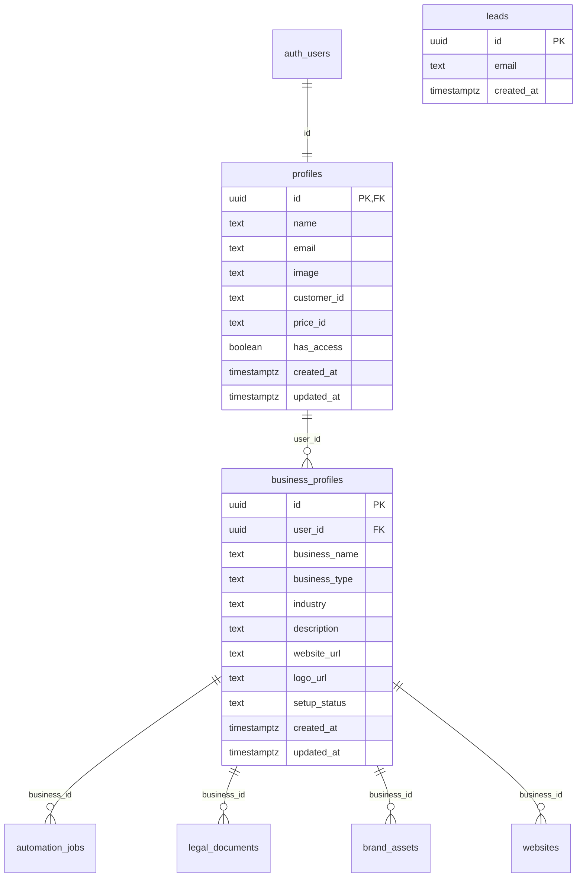

# Database Schemas Documentation

## Schema Overview

The Sigma platform uses PostgreSQL through Supabase with Row Level Security (RLS) enabled for data protection. All tables follow a consistent naming convention and include proper timestamps and security policies.

## Current Schema

### Table: `leads`
**Purpose:** Capture and store waitlist signups from the landing page

```sql
CREATE TABLE IF NOT EXISTS leads (
  id uuid PRIMARY KEY DEFAULT gen_random_uuid(),
  email text,
  created_at timestamptz DEFAULT timezone('utc'::text, now()) NOT NULL
);

-- Enable Row Level Security
ALTER TABLE leads ENABLE ROW LEVEL SECURITY;

-- Policy: Allow public inserts for waitlist signups
CREATE POLICY "insert_lead" ON leads
  FOR INSERT 
  TO public 
  WITH CHECK (true);
```

#### Schema Details
| Column | Type | Constraints | Description |
|--------|------|-------------|-------------|
| `id` | uuid | PRIMARY KEY, DEFAULT gen_random_uuid() | Unique identifier for each lead |
| `email` | text | nullable | Email address from waitlist signup |
| `created_at` | timestamptz | NOT NULL, DEFAULT timezone('utc'::text, now()) | Timestamp when lead was created |

#### Indexes
```sql
CREATE INDEX IF NOT EXISTS idx_leads_email ON leads(email);
CREATE INDEX IF NOT EXISTS idx_leads_created_at ON leads(created_at DESC);
```

#### RLS Policies
- **insert_lead**: Allows anonymous users to insert new leads (waitlist signups)
- **Admin access**: Service role can read all leads for management

---

### Table: `profiles`
**Purpose:** Store user profile information with Stripe integration for subscription management

```sql
CREATE TABLE IF NOT EXISTS profiles (
  id uuid PRIMARY KEY,
  name text,
  email text,
  image text,
  customer_id text,
  price_id text,
  has_access boolean DEFAULT false,
  created_at timestamptz DEFAULT (now() AT TIME ZONE 'UTC'::text),
  updated_at timestamptz DEFAULT (now() AT TIME ZONE 'UTC'::text),
  
  -- Foreign key to Supabase auth.users
  CONSTRAINT profiles_id_fkey FOREIGN KEY (id) REFERENCES auth.users(id) ON DELETE CASCADE
);

-- Enable Row Level Security
ALTER TABLE profiles ENABLE ROW LEVEL SECURITY;

-- RLS Policies
CREATE POLICY "read_own_profile_data" ON profiles
  FOR SELECT TO authenticated
  USING (auth.uid() = id);

CREATE POLICY "insert_own_profile_data" ON profiles
  FOR INSERT TO authenticated
  WITH CHECK (auth.uid() = id);

CREATE POLICY "update_own_profile_data" ON profiles
  FOR UPDATE TO authenticated
  USING (auth.uid() = id);

CREATE POLICY "delete_own_profile_data" ON profiles
  FOR DELETE TO authenticated
  USING (auth.uid() = id);
```

#### Schema Details
| Column | Type | Constraints | Description |
|--------|------|-------------|-------------|
| `id` | uuid | PRIMARY KEY, FK to auth.users(id) | User's unique identifier from Supabase Auth |
| `name` | text | nullable | User's full name |
| `email` | text | nullable | User's email address |
| `image` | text | nullable | URL to user's profile image |
| `customer_id` | text | nullable | Stripe customer ID for billing |
| `price_id` | text | nullable | Stripe price ID for subscription |
| `has_access` | boolean | DEFAULT false | Whether user has platform access |
| `created_at` | timestamptz | DEFAULT now() | Profile creation timestamp |
| `updated_at` | timestamptz | DEFAULT now() | Last profile update timestamp |

#### Indexes
```sql
CREATE INDEX IF NOT EXISTS idx_profiles_email ON profiles(email);
CREATE INDEX IF NOT EXISTS idx_profiles_customer_id ON profiles(customer_id);
CREATE INDEX IF NOT EXISTS idx_profiles_has_access ON profiles(has_access);
CREATE INDEX IF NOT EXISTS idx_profiles_updated_at ON profiles(updated_at DESC);
```

#### RLS Policies
- **read_own_profile_data**: Users can only read their own profile
- **insert_own_profile_data**: Users can only create their own profile
- **update_own_profile_data**: Users can only update their own profile
- **delete_own_profile_data**: Users can only delete their own profile

---

## Database Functions

### Function: `update_updated_at()`
**Purpose:** Automatically update the `updated_at` timestamp when a row is modified

```sql
CREATE OR REPLACE FUNCTION update_updated_at()
RETURNS TRIGGER AS $$
BEGIN
  NEW.updated_at = now();
  RETURN NEW;
END;
$$ LANGUAGE plpgsql;
```

### Function: `handle_new_user()`
**Purpose:** Automatically create a profile when a new user signs up

```sql
CREATE OR REPLACE FUNCTION handle_new_user()
RETURNS TRIGGER AS $$
BEGIN
  INSERT INTO public.profiles (id, email)
  VALUES (NEW.id, NEW.email);
  RETURN NEW;
END;
$$ LANGUAGE plpgsql SECURITY DEFINER;
```

## Database Triggers

### Trigger: `update_profiles_updated_at`
**Purpose:** Automatically update `updated_at` column on profile changes

```sql
CREATE TRIGGER update_profiles_updated_at
  BEFORE UPDATE ON profiles
  FOR EACH ROW
  EXECUTE FUNCTION update_updated_at();
```

### Trigger: `on_auth_user_created`
**Purpose:** Create profile automatically when user signs up

```sql
CREATE TRIGGER on_auth_user_created
  AFTER INSERT ON auth.users
  FOR EACH ROW
  EXECUTE FUNCTION handle_new_user();
```

## Planned Schema Extensions

### Phase 2: Enhanced User Management

#### Table: `business_profiles`
```sql
CREATE TABLE IF NOT EXISTS business_profiles (
  id uuid PRIMARY KEY DEFAULT gen_random_uuid(),
  user_id uuid NOT NULL REFERENCES profiles(id) ON DELETE CASCADE,
  business_name text NOT NULL,
  business_type text,
  industry text,
  description text,
  website_url text,
  logo_url text,
  setup_status text DEFAULT 'pending',
  created_at timestamptz DEFAULT now(),
  updated_at timestamptz DEFAULT now()
);
```

#### Table: `automation_jobs`
```sql
CREATE TABLE IF NOT EXISTS automation_jobs (
  id uuid PRIMARY KEY DEFAULT gen_random_uuid(),
  user_id uuid NOT NULL REFERENCES profiles(id) ON DELETE CASCADE,
  business_id uuid REFERENCES business_profiles(id) ON DELETE CASCADE,
  job_type text NOT NULL, -- 'legal', 'branding', 'website', 'payment', 'marketing'
  status text DEFAULT 'queued', -- 'queued', 'processing', 'completed', 'failed'
  progress integer DEFAULT 0,
  result_data jsonb,
  error_message text,
  created_at timestamptz DEFAULT now(),
  updated_at timestamptz DEFAULT now(),
  completed_at timestamptz
);
```

### Phase 3: Business Automation Services

#### Table: `legal_documents`
```sql
CREATE TABLE IF NOT EXISTS legal_documents (
  id uuid PRIMARY KEY DEFAULT gen_random_uuid(),
  business_id uuid NOT NULL REFERENCES business_profiles(id) ON DELETE CASCADE,
  document_type text NOT NULL,
  document_url text,
  status text DEFAULT 'draft',
  filing_number text,
  filed_at timestamptz,
  expires_at timestamptz,
  created_at timestamptz DEFAULT now(),
  updated_at timestamptz DEFAULT now()
);
```

#### Table: `brand_assets`
```sql
CREATE TABLE IF NOT EXISTS brand_assets (
  id uuid PRIMARY KEY DEFAULT gen_random_uuid(),
  business_id uuid NOT NULL REFERENCES business_profiles(id) ON DELETE CASCADE,
  asset_type text NOT NULL, -- 'logo', 'color_palette', 'typography', 'guidelines'
  asset_url text,
  metadata jsonb,
  version integer DEFAULT 1,
  is_active boolean DEFAULT true,
  created_at timestamptz DEFAULT now(),
  updated_at timestamptz DEFAULT now()
);
```

#### Table: `websites`
```sql
CREATE TABLE IF NOT EXISTS websites (
  id uuid PRIMARY KEY DEFAULT gen_random_uuid(),
  business_id uuid NOT NULL REFERENCES business_profiles(id) ON DELETE CASCADE,
  domain_name text,
  subdomain text,
  deployment_url text,
  template_id text,
  custom_config jsonb,
  status text DEFAULT 'building', -- 'building', 'deployed', 'maintenance', 'error'
  deployed_at timestamptz,
  created_at timestamptz DEFAULT now(),
  updated_at timestamptz DEFAULT now()
);
```

## Data Relationships



## Migration Strategy

### Version Control
Each schema change will be tracked with migration files:
- `001_initial_schema.sql` - Current leads and profiles tables
- `002_business_profiles.sql` - Add business profile functionality
- `003_automation_jobs.sql` - Add job queue system
- `004_service_tables.sql` - Add legal, branding, website tables

### Migration Execution
```sql
-- Check current schema version
SELECT version FROM schema_migrations ORDER BY version DESC LIMIT 1;

-- Apply migrations in order
\i migrations/002_business_profiles.sql;
\i migrations/003_automation_jobs.sql;
-- etc.
```

### Rollback Strategy
Each migration includes rollback statements:
```sql
-- Migration: 002_business_profiles.sql
-- Rollback: DROP TABLE business_profiles CASCADE;
```

---

*This schema documentation will be updated as new tables and relationships are added to the platform.*